https://www.searchautoparts.com/motorage/maintenance-repair-service-repair/making-sense-ion-sense-technology

980140 - The Comparison of Mass Fraction Burned
Obtained from the Cylinder Pressure Signal and
Spark Plug Ion Signal - Very useful   
Chao F. Daniels
Champion Ignition Products

For many years at Champion, spark plug ion sensing has
been used to detect engine pre-ignition in order to select
the proper heat range spark plug for an engine. In recent
years, ion sensing again became a topic of interest due
to its increasing applications in engine diagnostic and
engine control, such as misfire and knock detection;
spark timing control; A/F ratio detection and even pressure estimation (Eriksson, et al. 1996, 1997; Satizkoff, et
al. 1996, 1997). 

 Figure 1 shows a typical ionization signal obtained through a spark plug. As has been
discussed in much of the literature, the first peak of this
signal is the result of ignition pulse. The second peak is
the flame front passing through the gap. The third peak,
which has been called postflame by many researchers,
usually correlates well with the pressure signal and can
be used to interpret the peak pressure location for spark
timing control (Eriksson, Nielsen, and Glavenius, 1997)
and gas temperature sensing around the spark gap
(Satizkoff, 1997). After the third peak, the ion signal follows the pressure signal but declines more rapidly to a
lower value. 

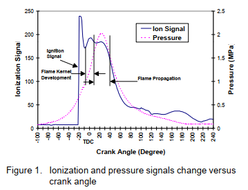  

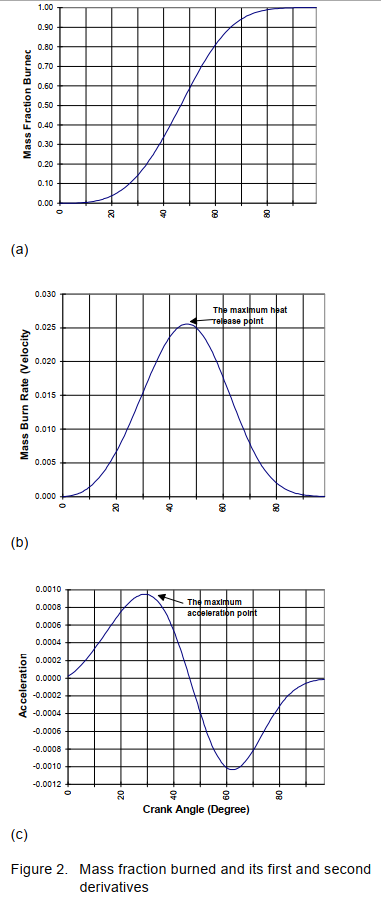  

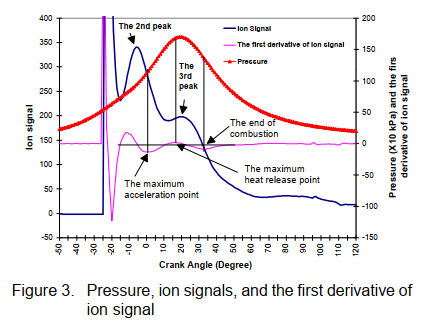

Therefore, the change in the ion signal
reflects the temperature change in the vicinity of the
spark plug. 

By now, we have found the maximum acceleration point
(q1), the maximum heat release point (q2), and the end of
combustion (Dq). Based on Figure 2, at the maximum
heat release point, the second derivative of the Wiebe
function should be zero and the third derivative of Wiebe
function should be zero at the maximum acceleration
point. Therefore:

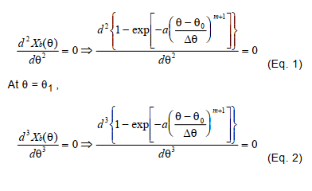

Combining both conditions, we are able to obtain constant a and m, and further to construct a Wiebe function
to describe the mass fraction burned versus crank angle.
For example, at 1600 rpm, 24° BTDC spark timing, the
maximum acceleration point, the maximum heat release
point, and the end of combustion point are: 28°, 42°, and
57° from the ignition point. According to equation (1) and
(2), parameter a and m are 2.24 and 2.68 respectively.
Then the MFB for this operating condition is:

where q is the crank angle difference between the calculated point and the ignition point.

The ionization current was
established by applying a bias DC voltage 150 V across
the spark plug gap. When there is conduction between
the gap, the current can be captured through the 100 KW
resistor. The signal was then sent to the DSP system

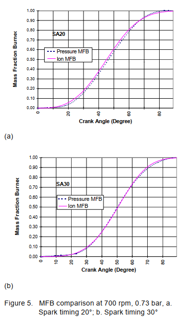

Based on an ionization signal, once the maximum
acceleration and the maximum heat release point locations are determined, both a and m in the Wiebe function
are decided. Since the end of combustion (defined
through the ionization signal) does not necessarily mean
MFB being 1, changing the end of combustion location
does not affect the shape, the values, and parameter m
of ion MFB curve, but changes the values of parameter a.
In other words, changing a will not change the shape and
values of the MFB curve but will extend the end of combustion to a different location if the maximum acceleration and maximum heat release locations are the same.
As the spark timing changes from 20° to 25° and to 30°,
parameter m increases from 2.13 to 2.51 and to 2.85.
Parameter a also increases as spark timing becomes
more advanced. Both of the maximum acceleration
points and the maximum heat release points are delayed
at more advanced spark timing conditions due to the
lower initial pressure and temperature at ignition. Earlier
spark timing allows the mixture more time for combustion
to complete before the exhaust valve opens, which
results in the efficiency parameter a becoming larger.

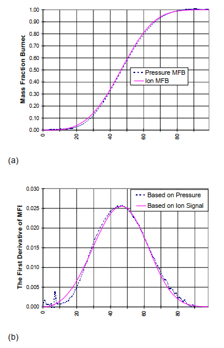

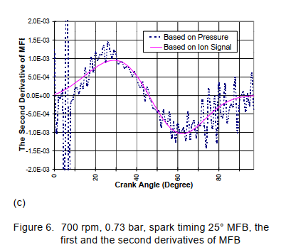

For 10% and 50%, the correlation factors are rather high. For 90% mass fraction
burned, due to the influence of the deceleration point and
heat loss, the correlation factor is lower than the other
two. However, generally speaking, using ionization signal
to interpret the mass faction burned gives us fairy decent
results and offers an easier alternative to obtain mass
fraction burned.

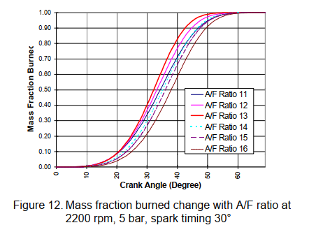

Figure 12 shows the mass fraction burned at different
equivalence ratios obtained through the ionization signals
when the engine was operating at 2200 rpm, 4.5 bar
BMEP, and spark timing was 30° before TDC. As the
combustion mixture became richer, the combustion process took less crank angle to complete until the equivalence ratio is approximately 1.1 (A/F=13). Further
enrichment actually slowed down the combustion process. This is consistent with the combustion characteristic of the fuel. Around equivalence ratio 1.1, the laminar
flame speed of air/fuel mixture usually reaches its maximum, which shortens the combustion duration and
enhances the combustion efficiency. As the equivalence
ratio became larger or the fuel became richer, form factor
m became smaller. However, the efficiency parameter a
reached its highest values when the equivalence ratio
was around 1.1 (Figure 13)

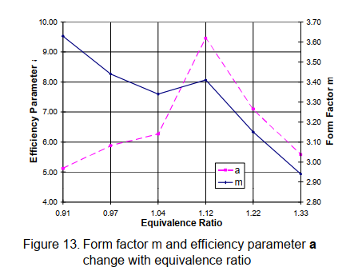

Obviously, the larger or
the colder the electrodes is, the easier for the electrode to
capture the free ions, and the ion intensity measured by
this kind of spark plug will be stronger.

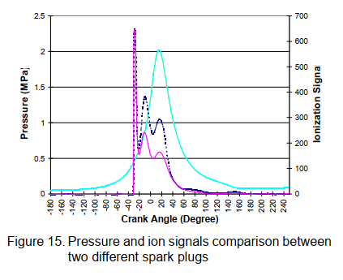

Here, we use the
reverse Rassweiler-Withrow method and take the heat
transfer into consideration by selecting a constant polytropic index (1.3) before and after the combustion. Right
after the inlet valve is closed, an isentropic compression
process is assumed and the pressure signal is estimated
by using the initial pressure obtained from a MAP sensor.
After the ignition occurs, the pressure increase due to
combustion is combined with the pressure change due to
cylinder volume change. The pressure signal during the
combustion is calculated through the following equation:

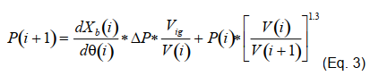

Where P(i) and P(i+1) are the pressure at the earlier and
latter iteration. V(i) and V(i+1) are the volumes. dXb(i)/
dq(i) is the first derivative of MFB obtained from the ionization signal. DP is the total pressure increase when
combustion occurs at the constant volume at the ignition
point. DP can be related to the pressure at the ignition
point through constant volume combustion relationship.
V
ig is the cylinder volume at the ignition point. Based on
this method, we can estimate pressure after the inlet
valve is closed and right before the exhaust valve is
opened.

---

980166 - In-Cylinder Air/Fuel Ratio Approximation Using
Spark Gap Ionization Sensing 

---

1999-01-0204 - Ion Current Sensing for Spark Ignition Engines
Jürgen Förster, Achim Günther, Markus Ketterer and Klaus-Jürgen Wald
Robert Bosch GmbH

https://sci-hub.tw/10.4271/1999-01-0204

Unlike the structure borne noise, both cylinder pressure
and ion current signals contain only local information on
the combustion. That means different results depending
on the measurement position. But a robust knock detection method must also operate reliably under unfavourable engine installation conditions.

This paper presents results of a closed-loop knock control with ion current and compares it with the structure
borne noise method.

IGNITION SYSTEM – Figure 1 describes the basic concept. The primary circuit contains the battery, the primary
coil and the igniter. It is extended by an FET type spark
duration limitation element (SDL). During the energizing
Downloaded from SAE International by The Library | University of Bath, Tuesday, July 07, 20202
intervall and the initial spark phase the SDL is open. After
a predetermined spark duration the SDL generates a
short-circuit for the primary coil. The spark is quenched,
the primary current starts flowing again and the residual
energy is dissipated by the primary circuit resistances.
After a short time delay the ion current measurement can
be started.

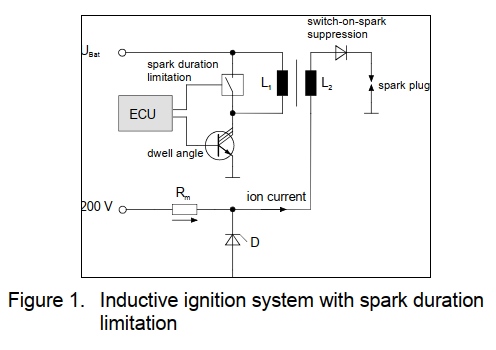

The SDL serves 3 main purposes:
1. It limits the spark to a map-dependent, calibrated
duration. As long as there is sufficient stored energy,
the spark duration is independent of spark energy.
Therefore the balance between reliable inflammation
and an early start of the ion current measurement
window can be controlled.
2. The measurement circuit, which contains the ignition
secondary coil, needs a sufficient bandwidth for
knock detection. The SDL uses the high coupling of
the ignition coil. A nearly ideal short-circuit of the primary coil by a FET improves the bandwidth of the
measuring circuit to 16-20 kHz using conventional
ignition coils (Fig.3). This is sufficient for a wide-band
knock detection.
3. The short circuit of the primary coil during the measurement windows prevents the transfer of interferences from the vehicles electromagnetic
environment.

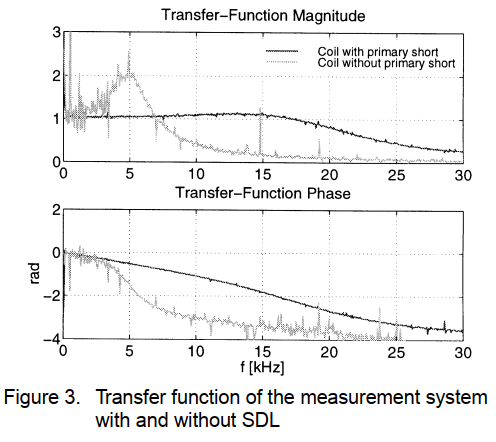

MEASUREMENT SYSTEM – Like the ignition system the
measurement system is a reasonable trade-off between
the demands of production and ion current measurement.
The measurement circuit is placed at the low tension side
of the secondary coil (Fig. 1). It contains the measurement voltage source, the measurement resistance,
extended by a measurement bridge, the secondary ignition coil, an optional switch-on-spark suppression diode
and the spark-plug gap.
The measurement power supply consists of a low power
DC/DC converter, which supplies a voltage of approximately 150 V to the electrodes of the spark plug. The
advantages are a good signal-to-noise-ratio and a unlimited measurement duration also in the presence of low
shunt resistances. The high internal resistance of the
power supply prevents from safety problems.
Different hardware functions serve for signal conditioning
and signal processing. An offset is estimated and subtracted from the ion current signal. An intelligent amplifier
controls the signal level. Two or more channels can be
multiplexed. After that the signal is divided in different,
optimized signal path’s for misfire and knock detection.
The signal conditioning and signal processing is very
suitable for on-chip integration. In addition the basic electronic concept can be splitted according to different conditions in the engine compartment, e.g. as a stand-alone
module or integrated into the engine management system.

FEATURE EXTRACTION – For classification between
regular combustion cycles and cycles with misfire, suitable features have to be extracted.
The analog preprocessing delivers an ion current signal
without any offset value. As the low frequency part of the
signal mainly contains the combustion information, the
high frequency part was suppressed by a fourth order
Bessel low-pass filter.
In respect to an easy implementation of the function for
misfire detection two plain features were used, the maximum value and the integral value of the ion current signal
within a specified measurement window.
To make the feature extraction independent of ignition
disturbances, the measurement window opens only after
spark quenching. Furthermore the measurement window
should have a sufficient time duration in order to give the
opportunity to detect even late combustions. A measurement window with a length of approximately 360 degree
crank angle offers an optimal detection possibility.

INFLUENCE FACTORS ON ION CURRENT – A large
number of influencing factors were investigated:
Fuel Additives – Figure 6 shows the effect of MMT and
MTBE additives on the ion current signal. At operation
points with small loads and engine speeds less than
3000 rpm there are almost no differences to the reference conditions. However if engine load or speed
increases, the ion current signal is getting much larger in
presence of MMT or MTBE. Obviously these additives
favor the ionization process at higher combustion temperatures. With MMT and MTBE the amplitudes of the ion
current signal can become up to 5 times larger. The differences between MMT and MTBE however are insignificant.

Exhaust-Gas Recirculation – Increased Exhaust-Gas
Recirculation (EGR) has the same effect on the ion current signal as an enleanment of the mixture. In case of
low EGR-rate the amplitude of the flame front part is
weakened first and the delay-time between ignition timing
and ion current start increases (Fig.4). When reaching
the combustion limit the ion current signal becomes rugged, the amplitude is even more reduced and the duration of the ion current signal increases.

Ignition Retard – Figure 7 shows, that the signal duration
increases with ignition retard, while the amplitude of the
ion current signal keeps constant. This effect is visible as
a shift of the feature-cluster of the combustion cycles in
direction of the positive x-axis.

Spark Plug – The spark plug has a significant influence
on the quality of the measured ion current signal. It
turned out, that especially spark plugs with a large surface of the centre electrode are very suitable. On the
other hand spark plugs with small centre electrodes
deliver an insufficient ion current signal.
The spark plug gap has also a slight effect on the ion current measurement. Starting with a plug gap of 0.7mm the
ion current signal enlarges with increasing the gap. However by reaching a plug gap of 1.1mm there is almost no
further amplification of the ion current by increasing the gap.

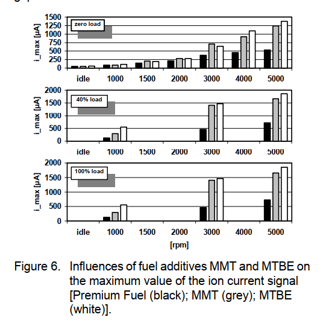

In an ion current system, the spark plug – used as a sensor - is located close to the source of the knock, for each
individual cylinder. During the post flame phase, the ion
current signal is proportional to cylinder-pressure. It
reflects both the basic bell-shaped signal and the superimposed oscillations in the presence of knock.
Oscillations along the cylinder axis can be neglected.

PROBLEMS – Knock sensor position – As can be seen
in figure 10, the amplitude of a given mode is a function
of position. In general, modes with zero amplitude at the
sensor position cannot be detected. For example, the
central position is blind for all circumferencial modes. A
decentral sensor is favourable, but it might, depending on
the exact distance from the center, miss radial modes. It
also randomly misses circumferencial modes, as the
angular orientation in an ideal cylinder is arbitrary and
therefore varies from cycle to cycle.
This theoretical result was confirmed by measurement of
the ion current and pressure signals. Both were taken at
the spark plug position during a hundred knocking combustions in two series production engines. The engines
are of comparable cylinder dimensions, but are different
in spark plug position. Figure 11 shows the spectra of
pressure and ion current measured at the decentral
spark plug of the first engine.
The second engine, with central spark plug position, was
equipped with an additional decentral pressure sensor,
which allows to compare central and decentral sensor
position on the same engine. Figure 12 shows the spectra of the second engine.
As expected, the spectra in figure 11 show more resonance modes compared with the ones of the central
spark plug. In the spectra belonging to decentral sensor
positions (figure 11, first spectrum in figure 12), the resonance peaks at 6 (respectively 8), 11 and 15 kHz can be
interpreted as the lowest circumferential modes. In the
central pressure spectrum (second spectrum in figure
12), the prevailing resonance peak at 13 kHz can be
interpreted as the lowest radial mode, which is slightly
visible in decentral pressure spectrum, too
In contrast to the central pressure spectrum, the corresponding ion current spectrum (figure 12) is very much
predominated by the 6 kHz peak. In addition, the 6 kHz
resonance is not suitable for knock detection, because it
also had considerable amplitude in knock free cycles.
With the 6 kHz masked in the ion current spectrum,
smaller resonance peaks appear at the resonance frequencies of the pressure signal measured at central
spark plug position. In figure 11, all pressure resonances
are well transferred into the ion current spectrum

Random distribution of knock energy – By some form of
accumulation (integral, weighted sum, etc.) of the amplitudes of relevant modes, a measure for knock severity,
the "knock energy" can be defined. Comparing the mean
spectrum (figure 11) with one of its constituents, the
spectrum of a single cycle (figure 13), we find, that resonance modes are not always excited in same proportion;
the knock energy is distributed randomly on different resonance modes.

 The conclusion from the
above statement is, that knock detection should not rely
on a single resonance mode but extend the evaluation to
other resonances in order to increase detection probability

COMPARSION OF RESULTS WITH STRUCTURE
BORNE NOISE METHOD – Figures 17, 18, and 19 show
the comparison of ion current and structure borne noise
based knock control at 1500/3000/5000 rpm, full load.
The structure borne noise knock control represents a
mass production application, in this case calibrated with
a strong priority on engine protection.
The knock control based on structure borne noise carefully avoids any knock, but allows considerable false
detections, especially at low engine speed.
At all engine speeds, the ion current knock feature shows
proportional behaviour with the knock reference. In figure
18, the ion current system did not detect knock in two
cycles of 5000. Nevertheless, the overall result is, that
good knock detection quality can be achieved with the
applied ion current feature. We expect, that the variation
of detection quality between different cylinders will be
small in comparison with the structure borne noise
method.

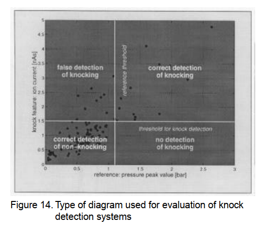

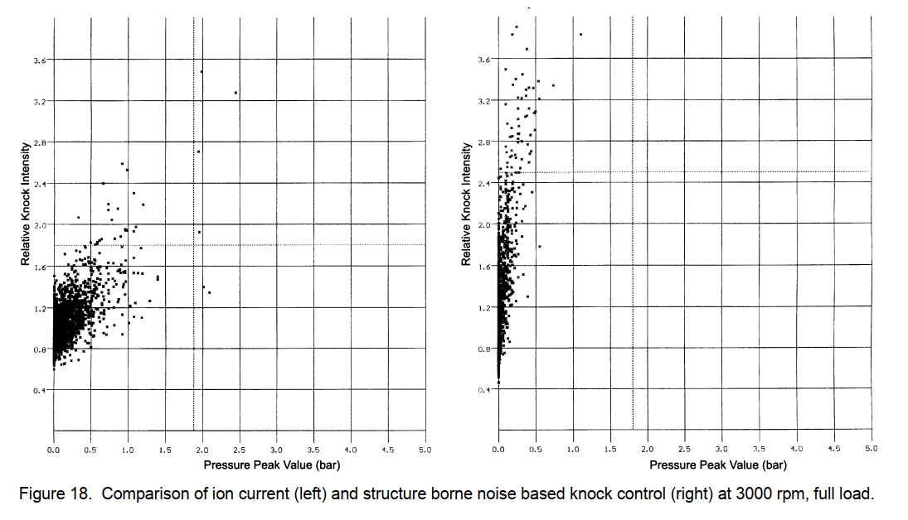

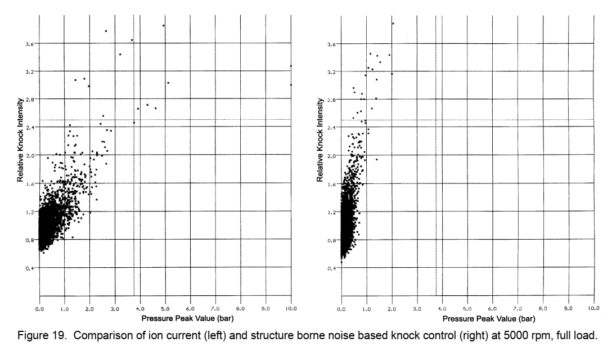

The modified ignition system requires only few changes
of the widespread inductive ignition system. The advantages, like low spark-plug erosion, are kept. The spark
duration limitation improves the bandwidth of conventional ignition coils, so that they can be used for ion current knock detection. Good results are obtained with a
measurement power supply, which delivers a voltage of
approximately 150 V to the electrodes of the spark plug.
Basic investigations show, that for misfire detection the
signal-to-noise ratio is small at operation points with zero
load. This especially applies to idling. The variance of the
signal pattern and the features of consecutive cycles is
impressive. But under all investigated conditions at two
individual engines a full range misfire detection is possible.
Fuel additives improve ionisation at speeds greater than
3000 rpm.This must be taken into account for functions
based on ion current amplitude. Influences like EGR,
ignition retard and spark plug geometry were investigated.
The homogeneous and stratified combustion of a series
production direct injection gasoline engine (GDI) leads to
an earlier start of the flame front phase and a short ion
current duration. But ion current sensing seems to be
feasible also on this GDI engine. It is important, that the
engine can be operated with the modified inductive ignition system and a spark duration of 800µs in the stratified
charge operation.
For knock detection the problems of sensor position and
random distribution of knock energy in the frequency
domain were investigated. With decentral spark plug
position better detection results are expected. The random distribution of knock energy requires a wideband
signal processing.
For the preselection of filter frequencies a two dimensional representation of an evaluation criterion was introduced.

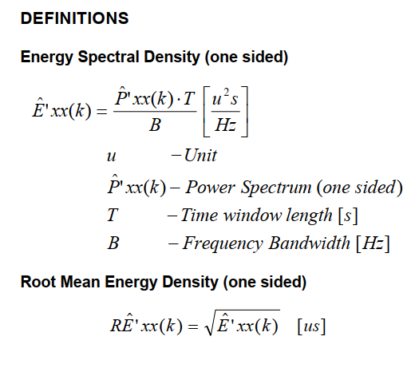

---

2017-01-0784
Investigation on Pre-Ignition Combustion Events and Development of Diagnostic Solutions Based on Ion Current Signals
Nicolo Cavina and Nahuel Rojo University of Bologna
Luca Poggio, Lucio Calogero, and Ruggero Cevolani Ferrari Auto Spa

Furthermore, the strong link between the angular position of the
rising edge of the ion signal and the combustion angular phase
confirms the robustness of the ion signal information content.
Local nature of this signal can occasionally lead to misdetection, if
flame initiation occurs far from the spark plug electrodes.

---

2000-01-0553 - Ignition System Integrated AC Ion Current
Sensing for Robust and Reliable
Online Engine Control

---

2004-01-0515 - Effects of Engine Operating Conditions on
In-Cylinder Air/Fuel Ratio Detection Using
a Production Ion Sensing Device

---

2006-01-0024 - Using Ion-current Sensing to Interpret Gasoline
HCCI Combustion Processes

---

2006-01-1345 - Analysis of SI Combustion Diagnostics Methods
Using Ion-Current Sensing Techniques

---

2008-01-0981 - Ionization Signal Response during Combustion Knock
and Comparison to Cylinder Pressure for SI Engines

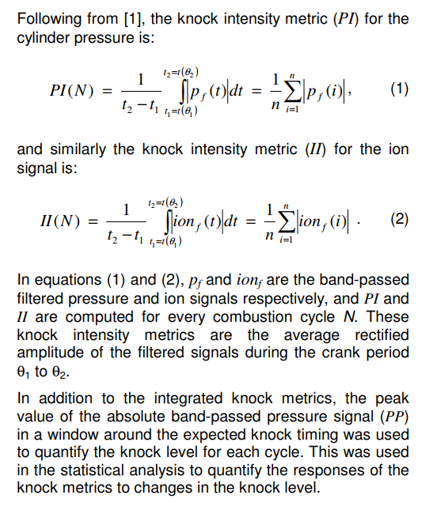

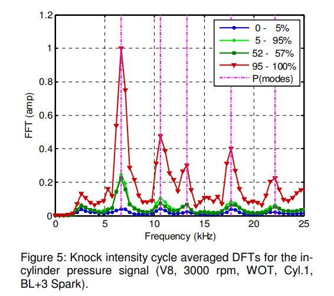

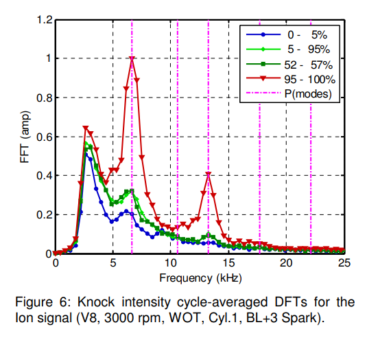

---

2010-01-0567 - Characteristics of Ion Current Signals in
Compression Ignition and Spark Ignition Engines - Mostly focused on HCCI/Diesel

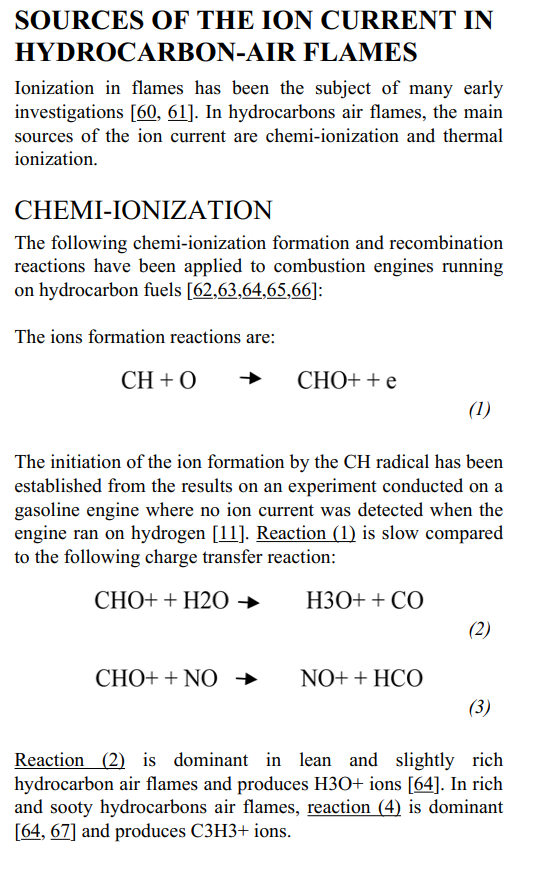

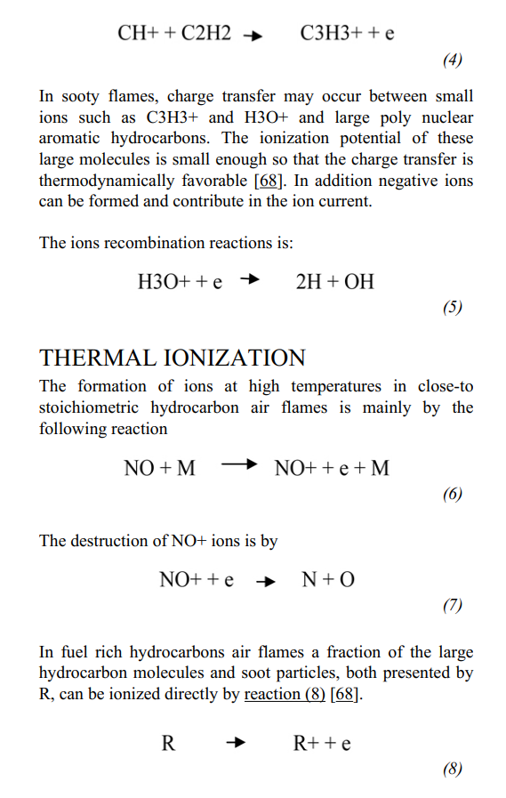

---

2011-24-0142 - Misfire and Partial Burn Detection based on Ion
Current Measurement

---

2013-01-0354 - Ion-Sense-Based Real-Time Combustion Sensing for Closed
Loop Engine Control - Gen 2 Delphi paper, bit of a sales pitch lacks detail. 

One of the difficulties in interfacing the
ionization current signal with a separate controller is ground
shift and ground noise. The intention of the design was to
minimize those effects. This is achieved by an electronic
architecture which delivers a current source type output,
thereby minimizing grounding effects. Consequently, a load
resistor is required in the receiving controller (ISDC) to
convert the current signal to a voltage for subsequent
processing by the fast analog-to-digital (A/D) converters. If a
variable (or selectable) load resistor is used in the receiving
controller, a real time automatic gain control function can
easily be implemented.

---

2017-01-0784 - Investigation on Pre-Ignition Combustion Events and Development of
Diagnostic Solutions Based on Ion Current Signals

---

950004 - Ion-Gap Sense in Misfire Detection,
Knock and Engine Control

https://sci-hub.tw/10.4271/950004

---

http://www.dragonfly75.com/motorbike/plugpolarity.html

So, on a well used spark plug, it can  usually be seen that one
electrode is worn more than the other. If the voltage polarity at the plug is negative, then wear will
occur on the centre electrode.

---

Image below shows model MK tested 

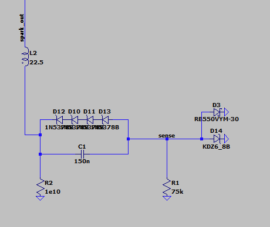

---

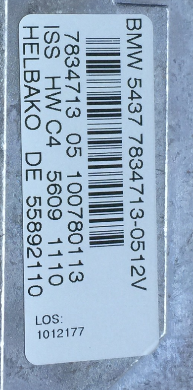

---

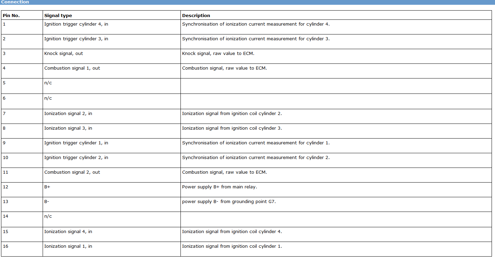

---

Miata 2019 coil - H6T61272 - Made by mitsubishi, SAAB coil is H6T60271

https://books.google.co.uk/books?id=6oNuwqxjNg4C&pg=PA2993&lpg=PA2993&dq=mitsubishi+ion+sense&source=bl&ots=ey1Iu_-AWd&sig=ACfU3U2d_cdQRzJcDGjx3CawR2nBc2gUWg&hl=en&sa=X&redir_esc=y#v=onepage&q=mitsubishi ion sense&f=false

---

Patents 

https://patents.google.com/patent/US20110210745  
A self power circuit for ion sense circuitry is provided. The self power circuit is configured to supply the voltages required to generate and measure an ion current flow in a combustion chamber of an engine. The power circuit stores power from the current flow in the ignition coil secondary circuit during at least a portion of a sparking period for use during the ion current measurement period between sparking events. Ion current generation voltage as well as positive and negative sensor circuit power supply voltages are generated in one embodiment.

https://patents.google.com/patent/US6498490  
Disclosed is a bias and measuring circuit that improves the ion sense measurement and ignition performance of an Ion Sense Ignition system where the ion current signal processing is implemented remote from the ignition coil. Specifically, the bias and measuring circuit of the invention reduces the effects of secondary harness capacitance on the ion current signal, minimizes the effects of harness electrical leakage and reduces the chances for “spark-on-make” (an ignition firing when the ignition coil primary is initially energized).

https://patents.google.com/patent/US4648367A/en  
Original SAAB patent - Expired 

---

Ford patent 6089077  
https://patents.google.com/patent/US6089077A/en

Cv is the specific heat at constant volume, Tf is the temperature at the ignition point, DeltaHcomb is the heat of combustion 

---

1. FFT the ion sense and look for knock, if knock exit the process here, trigger knock intervention logic, output 99 for all the following values and restart process.  
2. If no knock determine the angle of the second peak of the ion signal and store it as MFB50 (this may be enough for tuning)  
3. Differentiate the Ion signal and find the angle of the 3rd peak, store this as end of combustion EOC  
4. Store the MAP pressure at IVC or BDC if no IVC value set. (VVT will need to modify the IVC value)  
5. Pre-process the Cylinder volume and store it in ram  
6. Use the pre-processed volume and MAP value to get adiabatic pressure and temperature via PVnRT  
7. Use the MFB50 and the ECO values to back calculate the Wiebe function (not 100% on the exact way to do this yet but think it will just be a reverse wiebe calculation using spark angle, MFB50 and EOC)  
8. Use a calorific value for the fuel to calculate the energy input and due to fuel burned and thus temp rise per degree  
9. Use this temp rise and the previously calculated pressure,temp and volume to do another pass, adding the temperature and calculating the pressure  
10. spit out the angle and magnitude of the pressure peak.  

---
CORRECT SPARK PLUG POLARITY 

http://www.dragonfly75.com/motorbike/plugpolarity.html

---

Looks like this N series Peugeot coil has a spark booster gap too
Going to cut into it a bit to see if that can be eliminated to make a viable test coil
Thinking if they can be modified to eliminate the gap like the S85 coils must have then we can at least consider them an option for short term testing.
Potentially as a drop in coil for the N series engines when tuning and drop a normal one back in for day to day use.

Andrey  5:15 PM
that's a cheaper alternative to S85?

Simon - Orchardperformance  5:15 PM
Maybe
This one cost £17 delivered
Would make any used N series coil a viable option
They have 3 pins, one on the secondary coil like we need but no direct connection to the spark plug
Sometimes things have a second gap built into the system to prevent the coil discharging and not sparking at all when there is fuel or other liquid on the plug
By having a second gap before the plug the coil can fully charge and still sort of spark even if the electrodes of the plug are partly shorted.
But that totally F's up the Ion sense

Andrey  5:20 PM
interesting stuff!!! TIL

Simon - Orchardperformance  5:21 PM
Its why if you measure the secondary resistance on your V12 coils it will be infinite
Even though the 3 pin plug has one pin connected to the secondary
There is actually a sneaky second small gap where the red line is

